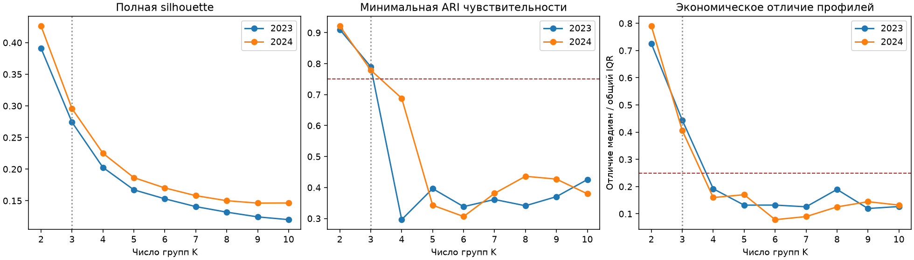

# Динамические экономические профили муниципалитетов

На исходной панели 2023–2024 выбрано три группы: это наиболее подробное разбиение, которое проходит заданные ограничения устойчивости и экономической различимости. Две группы устойчивее; при четырёх и более появляются близкие экономические профили и сильная чувствительность к весам признаков. Результат описывает потребительское сходство муниципалитетов и его связь с наблюдаемой экономикой.

## Данные и выборка

Использованы безналичные потребительские расходы СберИндекса по муниципалитетам за 24 месяца, справочник МО, годовые зарплаты и отраслевая занятость Росстата. Для внешнего контекста дополнительно используются индекс доступности рынков, дорожные расстояния и индекс мобильности СберИндекса, ИПЦ регионов Банка России, ночные огни VIIRS и официальные события (раздел «Внешний контекст»). Назначение, единицы и происхождение входов описаны в [реестре источников](../data/sources.csv) и [описании данных](../data/README.md).

Из 2190 МО с расходами оставлены 1774 с полной панелью, вне Москвы и Санкт-Петербурга. Состав выбран ретроспективно по наличию всех 24 месяцев. Это ограничивает перенос выводов на остальные территории и будущие годы.

## Признаки и временная нормировка

Из пяти наблюдаемых категорий расходов и положительного остатка «Прочее» получаем шесть долей корзины. Для доли $s_j$ используем CLR:

$$x_j=\log s_j-\frac{1}{6}\sum_{l=1}^{6}\log s_l.$$

Седьмой признак — логарифм общих расходов. Доли описывают структуру потребления, общий расход — его уровень; логарифмы уменьшают влияние масштаба и асимметрии.

В каждом месяце вычитаем региональный уровень с оценённым по дисперсиям сжатием к общему среднему. Масштабируем по медиане и IQR января–сентября 2023. Координаты корзины делим на $\sqrt{6}$, все координаты — на $\sqrt{2}$, чтобы исходные блоки имели сопоставимый вес. Это уменьшает влияние межрегионального уровня, поэтому группы описывают также относительное положение МО внутри региона.

Сглаживание $z_t=\alpha x_t+(1-\alpha)z_{t-1}$ выбирается по ошибке прогноза следующего месяца на октябре–декабре 2023. Проверены $\alpha\in\{1,0.75,0.5,0.25\}$; выбран $\alpha=0.5$. Наблюдения 2024 не участвуют в выборе масштаба и сглаживания.

## Сеть и кластеризация

Узел — МО с семью месячными признаками. Для каждого узла выбираем 12 ближайших соседей в евклидовом пространстве. Если $\sigma_i$ — расстояние до самого дальнего выбранного соседа, направленный вес равен:

$$w_{ij}=\exp\left(-\frac{\lVert z_i-z_j\rVert^2}{\sigma_i\sigma_j}\right).$$

Симметризуем максимумом двух направлений, удаляем петли. Локальные масштабы позволяют учитывать неодинаковую плотность профилей. Рёбра выражают сходство, а не наблюдаемые покупательские потоки.

Из нормализованного лапласиана получаем $K$ спектральных координат, нормируем строки и применяем KMeans с 20 инициализациями. Номера групп согласуем между соседними месяцами венгерским алгоритмом по максимальному пересечению. Потоки назначений показывают, какие МО сохранили или сменили группу. Между разными K разбиения пересчитываются независимо и не обязаны быть вложенными.

## Выбор K и сравнение методов

При одной и той же модели исследованы K=2…10 за оба года. Выбирается максимальный допустимый K **только по 2023**. Если верхняя граница проходит, поиск расширяется шагом 5 до 20; прохождение предельного K оставляет вопрос о максимуме открытым.

| Условие | Порог по умолчанию |
|---|---|
| Наименьшая группа в любом месяце | ≥ max(30 МО, 2% выборки), здесь 36 |
| Наибольшая доля группы | ≤ 85% |
| Минимальная ARI пяти seed | ≥ 0.80 |
| Минимальная ARI чувствительности | ≥ 0.75 |
| Минимальный Jaccard отдельной группы | ≥ 0.60 |
| Средняя полная silhouette | ≥ 0.10 |
| Экономическая наблюдаемость каждой декабрьской группы | ≥ 2 показателей с n≥20 и покрытием≥50% |
| Различимость каждой пары экономических профилей | ≥ 0.25 общего IQR хотя бы по одному достаточно наблюдаемому показателю |

Чувствительность проверяется на январе, июне и декабре: меняем вес корзины и расходов в 0.5 и 2 раза, число соседей на 8 и 16, добавляем шум σ=0.03. Пять seed проверяются во всех месяцах. Эти ограничения — рабочий критерий допустимости, а не установленное истинное число типов.

Сравнение включает KMeans, spectral с общим масштабом, тот же метод после EWMA, адаптивный spectral без EWMA и фиксированные прототипы K=2 и K=5. Четыре альтернативных месячных метода используют выбранный K. Все 15 последовательностей, включая варианты основного метода, оцениваются в общем несглаженном потребительском пространстве и на одном эталонном графе для месяца.

Рассчитываются обязательные SW, CH, S_Dbw, AVI, AVU и MQ. Для отбора K используется полная silhouette; выборочное SW на 600 МО также сохраняется. AVI оценивает изолированность групп, AVU — их объединённость. При K=2 AVU вырождается в 1; принятая конвенция MQ на симметричном графе даёт K×AVI. Поэтому рост MQ не служит аргументом за увеличение K. Конвенция MQ остаётся предварительной до уточнения определения организаторами.

## Экономическая проверка и результат

Зарплата, обследуемые работники на 1000 жителей и доли сельского/лесного хозяйства, обработки и публичных услуг **не входят в графы**. Профили 2023 используются при выборе K; показатели 2024 — для отложенной проверки. Пропуски сохраняются, медианы сопровождаются числом наблюдений и покрытием.

| K | Допуск 2023 / 2024 | ARI чувствительности 2023 / 2024 | Минимальное отличие профилей, IQR, 2023 / 2024 |
|---|---|---|---|
| 2 | да / да | 0.910 / 0.921 | 0.726 / 0.790 |
| 3 | да / да | 0.790 / 0.779 | 0.444 / 0.406 |
| 4 | нет / нет | 0.296 / 0.688 | 0.192 / 0.160 |
| 5–10 | нет / нет | ниже порога | ниже порога |

При K=3 декабрьские группы 2024 имеют следующие условные профили. Расходы и зарплата — медианы муниципальных показателей, не средние по всем жителям группы.

| Группа | МО | Расходы, ₽ | Зарплата, ₽ | Интерпретация |
|---|---:|---:|---:|---|
| 1 | 619 | 29 069 | 65 019 | Повышенные расходы и зарплаты, смешанная занятость, меньшая доля публичных услуг |
| 2 | 945 | 22 887 | 52 430 | Меньшие расходы и зарплаты, повышенные доли сельского/лесного хозяйства и публичных услуг |
| 3 | 210 | 35 103 | 74 461 | Самые высокие расходы и зарплаты, повышенные интенсивность занятости и доля обработки |

Для трёх отраслевых долей оценивается добавочный эффект **категориальных** групп после эффектов региона. 1999 перестановок меток внутри регионов, поправка Bonferroni на 27 проверок всех K. Для K=3 внутрирегиональный R² составляет 0.102 для сельского/лесного хозяйства, 0.094 для обработки и 0.304 для публичных услуг; скорректированные p равны 0.0135.

## Две оси: положение внутри региона и национальный тип

Признаки решения считаются после вычитания регионального уровня. Поэтому группы описывают **положение МО внутри своего региона**, а не тип экономики в масштабе страны. Это видно при сравнении с осями исследовательского модуля (`data/context/national_types.csv`, декабрь 2024):

- группа 3 (210 МО) — на 96 % «местные центры» региона;
- группа 2 (945 МО) — периферия и МО ниже среднего по региону, в национальной типологии это почти целиком два сельских типа;
- группа 1 (619 МО) — МО выше среднего по своему региону;
- согласие с внутрирегиональной осью ARI = 0.41, с национальными типами ARI = 0.20.

Национальная типология (k-средних по долям, уровню, сезонности и росту трат, K=5) отвечает на другой вопрос: чем похожи МО **разных** регионов. Её типы: «Крупные города», «Города „середины“», «Север и Дальний Восток», два сельских типа с разной ролью маркетплейсов. В карточке МО атласа показаны обе оси; сравнение методов — в разделе «Контекст».

## Внешний контекст 2023–2024

Блок `solution/context.py` выполняется после выбора K и не меняет графы и группы. Источники — только официальные и открытые научные данные: Росстат (БДМО), Банк России (ИПЦ регионов), СберИндекс (доступность рынков, дорожные расстояния, индекс мобильности), указы Президента и органы власти (события), ночные огни VIIRS. Результаты — в `notebook_results/context/` и в разделе «Контекст» атласа.

**Кого нет в данных.** В панели СберИндекса нет восьми субъектов со средним уровнем реагирования по Указу Президента № 757 от 19.10.2022 (Крым, Севастополь, Краснодарский край, Белгородская, Брянская, Воронежская, Курская, Ростовская области — 12.6 % населения) и всех 39 ЗАТО. Выводы относятся к остальной территории.

| Показатель (медиана или доля МО) | Группа 1 | Группа 2 | Группа 3 | R² внутри регионов |
|---|---:|---:|---:|---:|
| Население 2024, тыс. | 32 | 14 | 96 | 0.26 |
| Реальный рост трат 2024/2023 (ИПЦ региона), % | 6.4 | 4.6 | 8.7 | 0.22 |
| Ускорение роста во II полугодии 2024, п.п. | +0.9 | **+2.7** | −2.9 | 0.15 |
| Индекс доступности рынков | 308 | 312 | 327 | 0.10 |
| Индекс мобильности 2024, км (СЗФО, n=177) | 0.9 | 0.5 | 2.7 | 0.28 |
| Оборонно-промышленный рост зарплат, доля МО | 9 % | 5 % | 16 % | 0.02 |
| Экспортная отрасль, доля МО | 17 % | 4 % | 19 % | 0.06 |

Все связи значимы по перестановкам внутри регионов (p ≤ 0.005), кроме ночных огней на жителя (p = 0.96).

- **Реальные траты.** С поправкой на ИПЦ региона траты выросли на 4.6–8.7 %; быстрее всего — в местных центрах, медленнее всего — на периферии.
- **Ускорение периферии во втором полугодии 2024 года.** Годовой темп трат периферийных МО во II полугодии на 2.7 п.п. выше, чем в I полугодии, у местных центров — на 2.9 п.п. ниже. По времени это совпадает с Указом № 644 от 31.07.2024 (единовременные выплаты с 1 августа 2024 года). Причинность данными не доказывается.
- **Оборонно-промышленный рост.** По БДМО отмечены 99 МО: доля обработки в занятости 2021 года не ниже 20 %, и рост зарплат в обработке за 2021–2024 годы — в верхней четверти. Таких МО больше среди местных центров (16 %).
- **Санкции и экспорт.** Экспортные МО (уголь, лес, металлургия, нефть и газ, руды, удобрения, логистика; `data/context/export_mo.csv`) почти отсутствуют на периферии и сосредоточены в группах 1 и 3. В исследовательском модуле по БДМО:
  - уголь: отгрузка −26 п.п. к медиане страны в 2023 году;
  - лес и целлюлоза: траты растут на 2.6 п.п. медленнее, чем у соседей по региону (p = 0.006).
- **События.** Смена группы и всплеск трат в месяц события и следующий за ним:
  - эвакуация в Торопце (сентябрь 2024): МО сменило группу, траты −6.3 % (редкость 4.5 % среди месяцев МО);
  - паводки апреля 2024 (Орск, Оренбург, Курган, Ишим): переходов нет;
  - девальвация августа 2023: доля переходов не выше обычной.

  Группы устойчивы к локальным шокам, кроме экстремальных.
- **География.** По дорожным расстояниям СберИндекса только 2.5 % рёбер графа соединяют МО ближе 150 км (у случайных пар — 0.9 %). У пар одной группы — тоже 0.9 %. Группы — не географические районы: похожие МО находятся в разных частях страны.
- **Региональный контекст** (`data/context/regions_official.csv`, Банк России и «Регионы России»):
  - вклады населения в 2024 году росли быстрее там, где быстрее росли зарплаты (Спирмен 0.56);
  - регионы с бо́льшим экспортом на душу в 2021 году в 2024 году росли медленнее (−0.44). С учётом зарплаты и северности эффект около −1.5 п.п., p ≈ 0.1.

**Закон скейлинга.** Годовые траты МО растут как население в степени β = 1.13 [1.12; 1.14] (2024). Для общепита β = 1.54, для транспорта — 1.23, для продовольствия — 1.05. Крупные МО тратят на жителя больше, особенно на услуги, что согласуется с Bettencourt et al. (2007) и Sobolevsky et al. (2015). Это объясняет, почему размер МО так сильно разделяет группы (R² населения внутри регионов 0.26).

## Сравнение с нейросетями и подходами из литературы

Метки методов исследовательского модуля (`data/context/research_labels*.parquet`) оценены теми же ICVI на тех же месяцах 2024 в двух общих пространствах:

- в пространстве решения (после вычитания региона);
- в национальном — те же признаки без вычитания региона.

Методы исследовательского модуля:

- графовые нейросети на GPU: DGI, GAE, VGAE, DMoN, EvolveGCN-O, GConvGRU;
- подходы из литературы: архетипы PCHA, тензорная NTF, NMF «образы жизни», остатки закона скейлинга, k-Shape;
- национальные типы и якорная динамика по реальным тратам.

| Пространство | Лучший метод решения при K=3, SW | Лучший метод исследования, SW | Лучшая нейросеть, SW |
|---|---|---|---|
| внутри региона | spectral, локальный масштаб, K=3: 0.285 | GConvGRU: 0.018 | GConvGRU: 0.018 |
| национальное | EWMA spectral, общий масштаб, K=3: 0.135 | якорная динамика, K=5: 0.155 | GConvGRU: 0.089 |

- В своём пространстве группы решения заметно лучше: остальные методы строились на национальных признаках.
- В национальном пространстве национальная типология и её динамика не уступают методам решения при большем K.
- Нейросети не превзошли k-средних ни в одном пространстве. Пример из исследовательского модуля: TS2Vec + признаки даёт SW 0.220 против 0.224 у k-средних. Предобученные модели рядов (Chronos, MOMENT) полезны для прогноза доли летних трат, но не для типологии.
- SW и AVU выше при малом K: фиксированные прототипы K=2 дают SW 0.405 и 0.245. Поэтому сравнивать варианты стоит при одинаковом K.
- Полная таблица — `notebook_results/context/research_comparison.csv`.

## Границы выводов и материалы

Три группы — компромисс детализации и устойчивости; при более строгом пороге ARI чувствительности ≥0.80 остаются две. Экономические названия описательны. Повышенная доля отрасли не доказывает специализацию всего МО, а связь с группой не устанавливает причинность. Статистика занятости относится к обследуемым организациям без МСП; зарплаты работников не равны доходам жителей. Неодинаковая наблюдаемость может влиять на профили.

Этот отчёт фиксирует результат исходного набора и конфигурации по умолчанию. После изменения параметров актуальные значения находятся в `notebook_results/cluster_count_report.md`, таблицах CSV и интерактивной презентации `atlas.html`. Презентация содержит интерпретацию, сравнение K, карту, граф, переключение месяцев и карточки МО.
